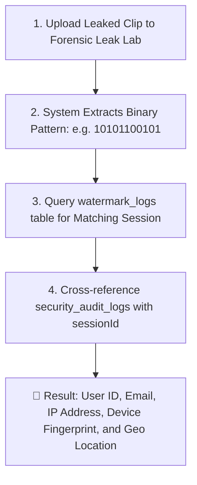

# FonixEdu SecurePlayer — Security Hardening & Threat Defense Runbook (Phase 3)

This document provides a low-level cybersecurity analysis, threat modeling, architecture specifications, and forensic audit procedures for the **FonixEdu SecurePlayer** content protection system.

---

## 1. Threat Model & Mitigations Overview

| Attack Vector | Hacker Technique | Defense Mechanism in SecurePlayer | Enforcement Level |
| :--- | :--- | :--- | :--- |
| **Token Replay / Stolen JWT** | User shares/sells active JWT token on Discord/Telegram to multiple friends. | **Client Device Fingerprinting (`X-Device-Fingerprint`)** + Server Session Binding. Token replayed on different hardware is rejected with `403 Forbidden`. | Backend Guard + TypeORM (`device_sessions`) |
| **Credential Pooling / Concurrent Abuse** | 10 students simultaneously stream using one shared account. | **Session Concurrency Limiter (`maxConcurrent = 2`)**. The 3rd session automatically evicts the oldest session with clean UI termination (`SESSION_EVICTED`). | `SessionLimitService` + PostgreSQL |
| **Impossible Travel / Geo-Hijacking** | Login token used in New York at 10:00 AM, then used in Tokyo at 10:05 AM (>900 km/h). | **Offline Haversine Geo-Anomaly Engine**. Distance & travel speed evaluated in <1ms without third-party API latency. Logged to `anomaly_flags`. | `GeoAnomalyService` + `geoip-lite` |
| **Scripted Media Ripping & Scraping** | IDM, curl, wget, yt-dlp, or Python scripts batch-downloading `.ts` chunks. | **Download Guard Middleware** (UA inspection) + **Azure CDN Edge Rate Limiting** (Max 120 req/min/IP). | Edge CDN + Express Middleware |
| **Tampered / Stolen SAS Token** | Attacker intercepts direct Azure Blob SAS URL and modifies query params. | **Azure CDN Edge URL Signing**. Expired or tampered signatures are rejected at the edge without touching storage origin. | Azure CDN / Front Door Edge |
| **AI Watermark Erasing** | Pirate runs video inpainting tools to blur visible canvas text. | **Forensic A/B Multi-Region Segment Watermarking**. Imperceptible delta baked into HLS compression segments; immune to video inpainting. | FFmpeg Dual-Variant Encoder |
| **Screen Recording / Screenshot Leaking** | Student records screen via OBS or captures screenshots. | **Drifting Visual Watermark** (Canvas physics) + **Mobile `ScreenCaptureGuard` Interface** (`FLAG_SECURE`). | React Player Canvas + Native Hooks |

---

## 2. Device Fingerprinting Architecture

### Client-Side Fingerprint Generation (`fingerprint.ts`)
The client calculates a SHA-256 hash across hardware and browser attributes:
1. **Canvas Micro-Render**: Renders multi-color text and geometry to detect GPU rendering quirks.
2. **WebGL Renderer String**: GPU hardware vendor and renderer unmasked info.
3. **Screen Geometry**: Resolution ($W \times H$) and color depth.
4. **Timezone & Hardware Concurrency**: CPU core count and timezone name.

### False-Positive Tradeoffs & Mitigation
- **Minor Browser Updates**: Fingerprint is verified on session creation and token issuance. Minor user-agent version changes within the same session don't cause sudden mid-video aborts.
- **Privacy Extensions**: If Canvas or WebGL is blocked by privacy tools (e.g. Brave / CanvasBlocker), the engine falls back to standard hardware metrics without breaking playback for paying students.

---

## 3. Concurrent Session Limits & Eviction

- **Default Limit**: `maxConcurrent = 2` active devices per student account.
- **Eviction Lifecycle**:
  ```mermaid
  sequenceDiagram
      autonumber
      actor Alice_Phone as Alice (Phone - Session 1)
      actor Alice_Laptop as Alice (Laptop - Session 2)
      actor Bob_Friend as Bob (Shared Login - Session 3)
      participant Backend as NestJS SessionLimitService
      participant DB as PostgreSQL (device_sessions)

      Alice_Phone->>Backend: Active Stream (Session 1)
      Alice_Laptop->>Backend: Active Stream (Session 2)
      Bob_Friend->>Backend: POST /auth/token (Session 3)
      Backend->>DB: Check active sessions count = 2
      Backend->>DB: Evict oldest session (Session 1: isRevoked = true)
      Backend->>Alice_Phone: Next Key Request -> 401 Unauthorized (SESSION_EVICTED)
      Alice_Phone->>Alice_Phone: UI displays "Signed out: opened on another device"
  ```
- **Tuning for Plan Tiers**:
  In `SessionLimitService.enforceLimit(userId, sessionId, maxConcurrent)`, you can pass tier-specific limits (e.g., Free $= 1$, Pro $= 2$, Team/Family $= 5$).

---

## 4. Geo-Anomaly & Impossible Travel Detection

- **Zero-Latency Offline Resolution**: Uses local MaxMind `geoip-lite` database (0 network round-trips).
- **Haversine Distance Formula**:
  $$\text{distance} = 2 R \cdot \arcsin\left(\sqrt{\sin^2\left(\frac{\Delta \text{lat}}{2}\right) + \cos(\text{lat}_1)\cos(\text{lat}_2)\sin^2\left(\frac{\Delta \text{lon}}{2}\right)}\right)$$
- **Velocity Calculation**: $\text{Speed} = \frac{\text{Distance}}{\Delta t \text{ (hours)}}$.
- **Threshold**: Speed $> 900 \text{ km/h}$ and Distance $> 300 \text{ km}$.
- **Action Modes**:
  - `log_only` *(Default)*: Safely flags in `anomaly_flags` table without disrupting legitimate VPN users.
  - `require_reverify`: Challenges user with 2FA/re-auth.
  - `blocked`: Immediately blocks token.

---

## 5. Post-Leak Forensic Investigation Guide

When a leaked video clip is discovered online, follow these steps to pinpoint the originating account:



### SQL Forensic Cross-Reference Query:
```sql
-- Step 1: Identify Session from Leaked Watermark Pattern
SELECT "userId", "sessionId", "videoId", "pattern", "issuedAt"
FROM watermark_logs
WHERE "videoId" = 'vid_425728' AND "pattern" LIKE '10101100101%'
ORDER BY "issuedAt" DESC;

-- Step 2: Correlate with Device Session & IP Audit Trail
SELECT 
    w."userId",
    w."sessionId",
    d."deviceFingerprint",
    d."ip" AS "client_ip",
    d."location",
    d."userAgent",
    a."eventType",
    a."createdAt" AS "event_time"
FROM watermark_logs w
JOIN device_sessions d ON w."sessionId" = d."sessionId"
JOIN security_audit_logs a ON w."sessionId" = a."sessionId"
WHERE w."sessionId" = 'sess_alice_101'
ORDER BY a."createdAt" ASC;
```

---

## 6. Mobile Screen Capture Interface (`ScreenCaptureGuard`)

The interface in `player/src/security/screen-capture.ts` defines native hardware screen protection hooks for mobile builds:

- **Android Implementation**:
  ```java
  // In MainActivity.java / React Native Activity
  getWindow().setFlags(
    WindowManager.LayoutParams.FLAG_SECURE,
    WindowManager.LayoutParams.FLAG_SECURE
  );
  ```
- **iOS Implementation**:
  ```swift
  // In iOS Player View Controller
  NotificationCenter.default.addObserver(
    self,
    selector: #selector(screenCaptureChanged),
    name: UIScreen.capturedDidChangeNotification,
    object: nil
  );
  ```

---

## 7. HTTP & Edge Hardening

- **Helmet CSP**: Restricts media sources strictly to Azure Blob Storage and designated CDN edges.
- **Throttler Rate Limiting**: Max 120 req/min globally with tight throttles on `/keys` and `/auth`.
- **Short-TTL Tokens**: Session tokens expire in 60 seconds and are signed with HMAC-SHA256.
